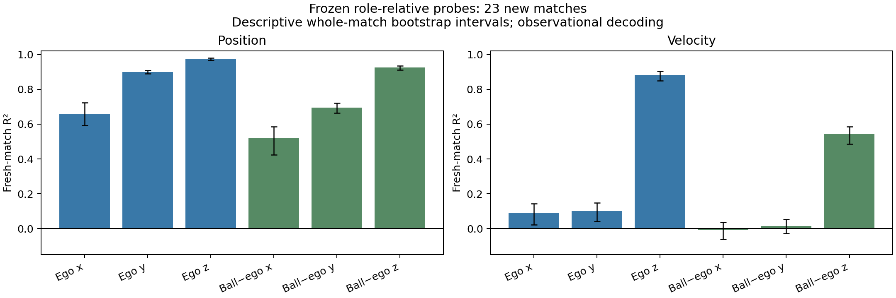
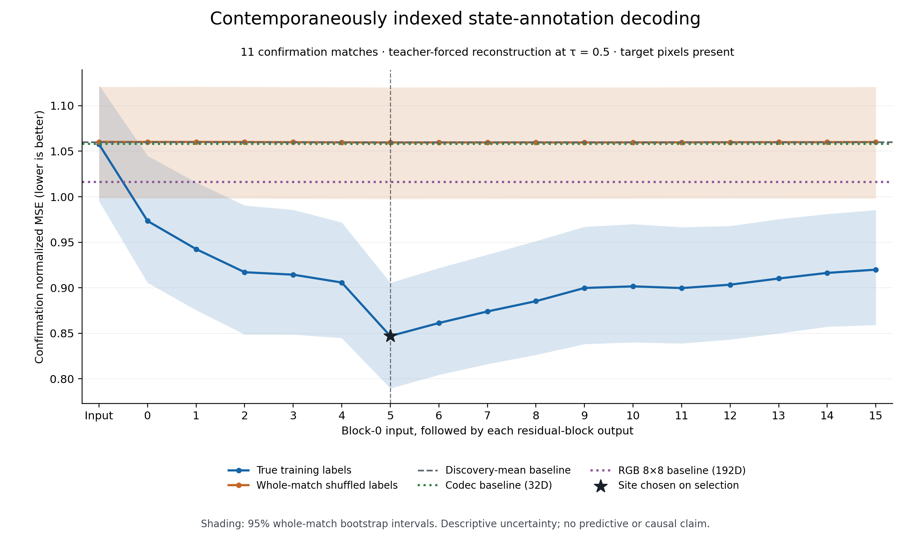
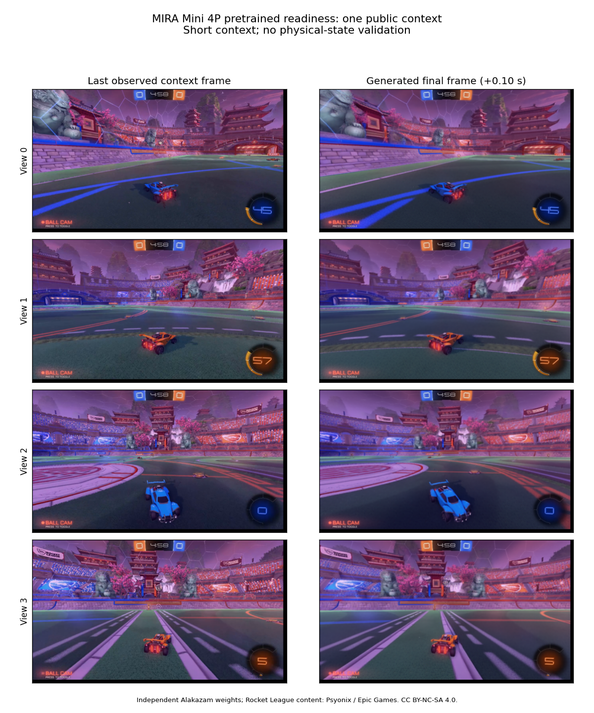

# MIRA physical-state interpretability

This project tests whether a video world model represents physical state in coordinates
that can causally control its predicted trajectories. Experiments advance only after
their prerequisites pass. A software test is not evidence of a physical representation.

## Current execution

**The repaired readouts passed fresh confirmation.** On 23 new matches, frozen
viewing-player and ball-relative position probes achieved **80.9% lower error
than their mean baseline**. Ego position R² was **0.660 / 0.900 / 0.974** for XYZ;
ball-minus-ego position R² was **0.520 / 0.694 / 0.926**. Horizontal velocity remains
weak. All 184 clips, 4,416 scored rows, 32 fixed readouts and their bootstrap
comparisons passed an independent audit. See the
[fresh results and limitations](docs/11_fresh_confirmation_results.md).

The [literature-led review](docs/08_review_and_repair.md) led to corrected
checkpoint precision/preprocessing, stronger baselines, spatial readouts and
viewing-player-relative targets. The target convention produced the clearest
improvement; the tested spatial descriptor did not beat mean pooling. Choices
were published before the new confirmation capture, and the original study is
preserved. Exact internal causal interventions, geometry comparisons, 30 sparse
models, and VideoMAE adaptation have completed and passed independent audits.
Sparse causal fidelity and generated-rollout steering are the active next steps.

The geometry comparisons did **not** establish a nonlinear advantage: quadratic
height, speed and vertical-velocity gains were small and their match-bootstrap
intervals included zero; extra heading harmonics worsened held-out prediction.
ReLU Top-K reconstructed held-out descriptors better than the block variants,
and correct temporal pairing did not beat the shuffled-time control. These
negative findings remain visible in the [geometry report](docs/review/geometry_development_results.md)
and [all-30-model sparse audit](docs/review/sparse_development_audit.md).

The [adapted VideoMAE evaluator](docs/review/video_evaluator.md) reduced development
state-regression NMSE from **0.797 to 0.698**; codec-reconstruction NMSE is **0.706**.
Relative horizontal velocity remains weak. This calibration covers recorded and
codec-reconstructed clips; accuracy on edited generated video is unverified.

Pretrained execution and intervention wiring have passed on NVIDIA A40 GPUs. Official MIRA code is pinned
to `3d739ec2d31daf83559d33eb01727cea48fe90f7`. Official pretrained MIRA weights were not
found in the checked release channels. The executable model candidate is **Alakazam's
MIRA Mini 4P**, an independently trained 1B reproduction, with separately pinned weights.
Results for this model must not be described as results for the original 5B MIRA.

Rocket Science access is working, and all 31.1 GB of the pinned test split passed
publisher checksum verification. The full 61-match data audit rejected eight
matches at the unchanged clock-calibration gate. A separately registered
[quality-qualified study](docs/05_cohort_amendment.md) retains all 53 passing
matches: 31 discovery, 11 selection, and 11 confirmation, eight clips each.
The original failed audit and all exclusions remain available.

The full two-GPU capture and independent aggregation passed: **424 clips, 13,568
rows, all 17 sites**. Each GPU peaked at 6.51 GiB. Every saved label, timestamp,
player/view identity and source-frame join was checked against the audited input.

**The original observational pilot is complete.** The site chosen before confirmation
(block 5 output) achieved **20.1% lower standardized error than the mean baseline**
on 11 confirmation matches. Ball-position R² was **0.506 / 0.758 / 0.871** for X/Y/Z;
horizontal ball velocity and many player velocities remained weak. All **46 tests**
and **91 completion checks** passed. See the [results and limitations](docs/07_observational_results.md).

These readouts measure annotation decoding with observed target pixels present.
Attribution screening covered all 17 sites on 31 discovery matches with two
paired seeds. All **660 exact interventions** on 11 separate selection matches
passed their independent audit. Full donor replacement had a positive mean
output-proxy effect but improved only 6/11 matches; probe-direction edits had tiny
effects. See the [causal study and specificity limits](docs/09_internal_causal_development.md).
The review corrects an overly restrictive stopping gate: internal patching can
proceed with recipient actions fixed, without simulator resets.
Isolated physical-control claims still need suitable counterfactuals and an
independently validated generated-video measurement. The full proposal is **not complete**.

The [pretrained readiness report](results/pretrained_smoke.json) records strict loading,
all 16 residual layers plus block-0 input, exact no-op controls, and generated output
invariance to hidden future-frame placeholders. The short run took 44.6 seconds and
peaked at 4.65 GiB allocated GPU memory. This is not a full-study memory estimate.

The figure is a two-frame readiness continuation from Alakazam's public example.
It does not measure physical accuracy. Full saved readiness tensors are packaged in
the [readiness release](https://github.com/guptaishaan/mira-interp/releases/tag/readiness-2026-09-06),
with checksums in [the archive manifest](results/readiness_archive.json).

## Work and documentation

- [Completed observational results, CSVs and figures](docs/07_observational_results.md)
- [Literature review and diagnosis](docs/08_review_and_repair.md)
- [Revised development readouts](docs/10_development_readout_results.md)
- [Fresh confirmation and independent audit](docs/11_fresh_confirmation_results.md)
- [Registered internal causal study](docs/09_internal_causal_development.md)
- [Geometry comparisons and independent audit](docs/review/geometry_development_results.md)
- [Sparse feature comparisons and retention audit](docs/review/sparse_development_audit.md)
- [Adapted VideoMAE evaluator](docs/review/video_evaluator.md)
- [Generated-video measurement contract](docs/11_generated_video_evaluator.md)
- [Protocol and stage gates](docs/PROTOCOL.md)
- [Environment and reproducibility](docs/00_setup.md)
- [Model availability audit](docs/model_access_audit.md)
- [Data preparation](docs/01_data.md)
- [Residual hooks and patching tests](docs/02_instrumentation.md)
- [Pretrained model readiness](docs/03_pretrained.md)
- [Real-observation capture](docs/04_capture.md)
- [All-layer probe analysis](docs/04_probes.md)
- [Cohort amendment and exclusions](docs/05_cohort_amendment.md)
- [Causal prerequisites and pair availability](docs/06_causal_prerequisites.md)
- [Current observational protocol](configs/observational_probe_v2.json)
- [Execution handoff](docs/EXECUTION_HANDOFF.md)

Compact reports live in `results/`; exportable figures live in `figures/`.
All pooled research features and full pilot residuals are in the
[observational results release](https://github.com/guptaishaan/mira-interp/releases/tag/observations-2026-09-06),
with [verified array and archive hashes](results/observation_archive.json).
Large downloaded weights and gated source data stay outside Git. Their provenance,
checksums, and reproducible download commands are recorded instead.
The revised [development features and models](https://github.com/guptaishaan/mira-interp/releases/tag/development-v3-2026-09-07)
and [fresh confirmation features](https://github.com/guptaishaan/mira-interp/releases/tag/fresh-confirmation-v3-2026-09-07)
are also published with verified remote checksums.

## Attribution

MIRA is by General Intuition, Kyutai, and collaborators:
[code](https://github.com/mira-wm/mira), [paper](https://arxiv.org/abs/2607.05352).
MIRA Mini is [Alakazam's independent reproduction](https://huggingface.co/alakazamworld/mira-mini-4p).
Rocket Science and MIRA Mini weights use CC BY-NC-SA 4.0. Rocket League content is
copyright Psyonix LLC / Epic Games, Inc. See [third-party notices](THIRD_PARTY.md).
