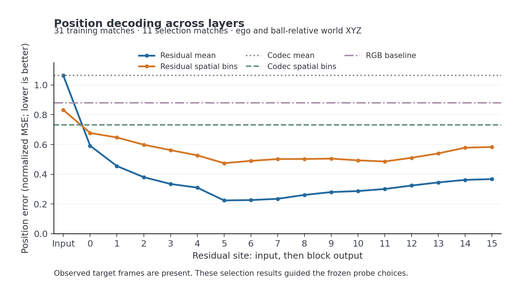
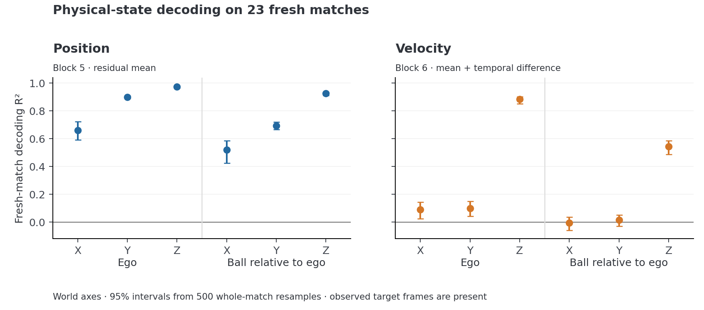

# mira-interp

Early work on physical-state representations in [MIRA Mini 4P](https://huggingface.co/alakazamworld/mira-mini-4p), using [Rocket Science](https://huggingface.co/datasets/kyutai/rocket-science).

So far: checked video/state alignment, captured all residual layers, and fit linear probes with separate matches for fitting, selection, and evaluation. Positions decode well on 23 new matches. Horizontal velocity is still weak.

These are results on observed clips. Whether the same representations can control generated trajectories is still an open question.

*All 17 sites, evaluated on the selection matches.*

*Fixed probes on 23 new matches. Error bars resample whole matches.*

[Methods and initial results](docs/progress/README.md) · [Experiment notes](docs/README.md)

- [Code](src/mira_interp/) and [scripts](scripts/)
- [Configs](configs/)
- [Results](results/) and [figures](figures/)
- [Larger artifacts](https://github.com/guptaishaan/mira-interp/releases)
