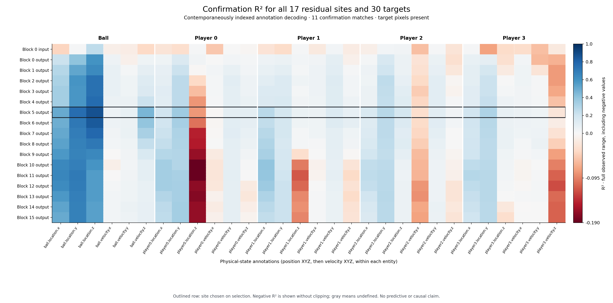

# Completed observational results

The frozen readout at **block 5 output** (the sixth transformer block) decoded
physical-state annotations with **20.1% lower standardized mean squared error
than the discovery-mean baseline** on 11 held-out confirmation matches.
Ball position was the clearest signal. Horizontal ball velocity and many player
velocities remained weak. This is partial annotation decoding, not reliable
full-state recovery or causal control.

The model is **Alakazam MIRA Mini 4P**, an independent reproduction of MIRA.
These are not results for the original 5B checkpoint. The transformer received
noisy encodings of observed target frames and clean observed past at diffusion
time 0.5. Target pixels were present; this study did not test future prediction.

## Dataset, selection, and verification

The separately registered quality-qualified cohort contains 53 matches:
31 discovery, 11 selection, and 11 confirmation. Eight clips per match produce
424 clips and 13,568 repeated rows across four views and eight latent pairs.
The original 61-match plan failed its data gate; eight clock-related exclusions
and all original roles are preserved in the
[amendment](05_cohort_amendment.md). The engineering pilot is separate.

Every one of the 17 residual sites was captured using a within-view spatial
mean. Ridge probes and a whole-match label-shuffle control used discovery-only
normalization and the same fixed alpha grid. Selection chose block 5 and
`alpha=1`. Coefficients and choices were committed and pushed before confirmation.
An independent audit checked all 38 main/control coefficient sets, with maximum
relative ridge normal-equation residual `5.59e-15`, without using confirmation
target rows. No probe was refitted on selection or confirmation.

The full two-GPU capture finished in about 4 minutes 40 seconds, with 6.51 GiB
peak allocated memory per GPU. Every saved source-label, timestamp, player/view,
and frame-index join passed the independent aggregate audit. All **46 software
tests** and **91 observational completion checks** passed. These are execution
checks; they do not make the later causal hypothesis pass.

## Held-out comparisons

Errors below average 30 coordinates after scaling by discovery target variance.
Lower values are better. Intervals are descriptive 95% whole-match bootstrap
intervals from 500 resamples of the 11 confirmation matches.

| Readout | Standardized MSE | 95% interval |
| --- | ---: | --- |
| Frozen block-5 output, 2048D | **0.8469** | 0.7894–0.9055 |
| Same site, shuffled discovery labels | 1.0596 | 0.9976–1.1202 |
| Discovery mean | 1.0602 | 0.9987–1.1212 |
| Codec spatial mean, 32D | 1.0581 | 0.9935–1.1256 |
| RGB 8×8 descriptor, 192D | 1.0161 | 0.9566–1.0808 |

The paired MSE improvement over the mean is **0.2133**, with interval
**[0.1917, 0.2352]**. Improvement over the codec readout is **0.2112**,
with interval **[0.1860, 0.2322]**; improvement over the same site's shuffled
control is **0.2127**, with interval **[0.1922, 0.2337]**.

The equally wide block-0 input readout scored 1.0577 MSE, so linear accessibility
under this particular readout improves after transformer processing. This is a
descriptive depth comparison. It does not imply that the input lacks physical
information: spatial averaging discards layout, and nonlinear processing can
expose information already present in the observed pixels. The 32D codec and
192D RGB baselines are not capacity-matched to the 2048D residual probes.

## Which variables decode

At the frozen site, ball-position R² is **0.506 / 0.758 / 0.871** for X/Y/Z.
Horizontal ball-velocity R² is only **0.052 / 0.072**, and both descriptive
intervals cross zero. Vertical ball-velocity R² is **0.459**. Player variables
are mixed; several velocity and height coordinates have zero or negative R².

| Ball annotation | R² | 95% R² interval | RMSE in source units |
| --- | ---: | --- | ---: |
| Position X | 0.506 | 0.306–0.650 | 1670.8 uu |
| Position Y | 0.758 | 0.720–0.780 | 1371.0 uu |
| Position Z | 0.871 | 0.851–0.894 | 174.0 uu |
| Velocity X | 0.052 | −0.067–0.138 | 940.4 uu/s |
| Velocity Y | 0.072 | −0.057–0.144 | 1146.0 uu/s |
| Velocity Z | 0.459 | 0.387–0.532 | 403.2 uu/s |

These absolute errors matter: a high R² does not establish the precision needed
to measure small physical interventions. All 30 targets, all 17 sites, all
baselines and shuffled controls are retained, including negative results.

- [Complete confirmation JSON](../results/probes_v2/confirmation.json)
- [All 1,140 target/model rows, CSV](../results/probes_v2/target_metrics.csv)
- [All 19 readouts, CSV](../results/probes_v2/site_summary.csv)
- [Frozen choices](../results/probes_v2/frozen_selection.json) and
  [coefficients](../results/probes_v2/frozen_models.npz)
- [Independent selection audit](../results/probes_v2/selection_audit.json)
- [Completion audit](../results/observational_completion_audit.json)
- Exportable figures: [layers PDF](../figures/observational_layers.pdf),
  [targets PDF](../figures/observational_targets.pdf)

## What remains unresolved

This is an observational analysis of a quality-qualified subset, with only 11
confirmation matches and no formal power calculation. Bootstrap intervals omit
retraining and seed uncertainty and do not provide family-wide significance.
Players can recur across matches. The world model's training-match manifest is
unavailable, so these matches are held out for interpretation but not proven
unseen during model training.

Per-view indexing follows the publisher's export contract, supported by source
hashes, frame counts, timestamps, identity checks and a limited pilot HUD check.
Zero video/state latency and exact 3D visual alignment are not independently
established for every frame.

The [controlled-pair availability audit](06_causal_prerequisites.md) examined
868 within-match discovery pairs and found zero identical four-player future
action streams over the prescribed horizon. This does not establish absence
of suitable pairs elsewhere in Rocket Science. Controlled state-reset/rendered
counterfactuals and an independent physical evaluator validated on generated
videos remain unmet prerequisites. Physical causal patching, geometry, SAE/BSF
recovery and steering were therefore not run.

The practical next step is to establish those controlled-pair and trajectory-
measurement inputs, then run the existing exact patching infrastructure under
the frozen causal controls. Observational decoding alone cannot open that gate.
